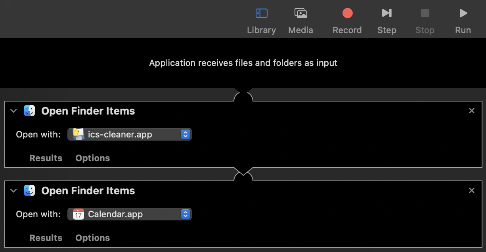

# ics-cleaner

Cleans up `*.ics` files to your liking.
 - Remove `VALARM` blocks so your calendar application doesn't try to copy all of the notifications of the source event.
   - This is particularly helpful when importing event invites into calendar applications that don't ignore the defined notifications (Looking at you iCalendar...)

...That's about it until I hit more pain points adding `*.ics` files to iCalendar.

## Dependencies

 - [pyinstaller](https://pyinstaller.org)

## Install

 - `make init`

## Build

 - `make build`
   - Will build to `dist/`

## Setup
 - Copy the build application into your system's `Application` folder

### Bonus: Configure `.ics` files to clean and open by default

Create an [Automator](https://support.apple.com/en-ca/guide/automator/welcome/mac) application that:
1. Receives files and folders as input
2. Opens the items with `ics-cleaner.app`
3. Opens the items with `Calendar.app`

## Resources
 - [iCalendar Wikipedia](https://en.wikipedia.org/wiki/ICalendar)